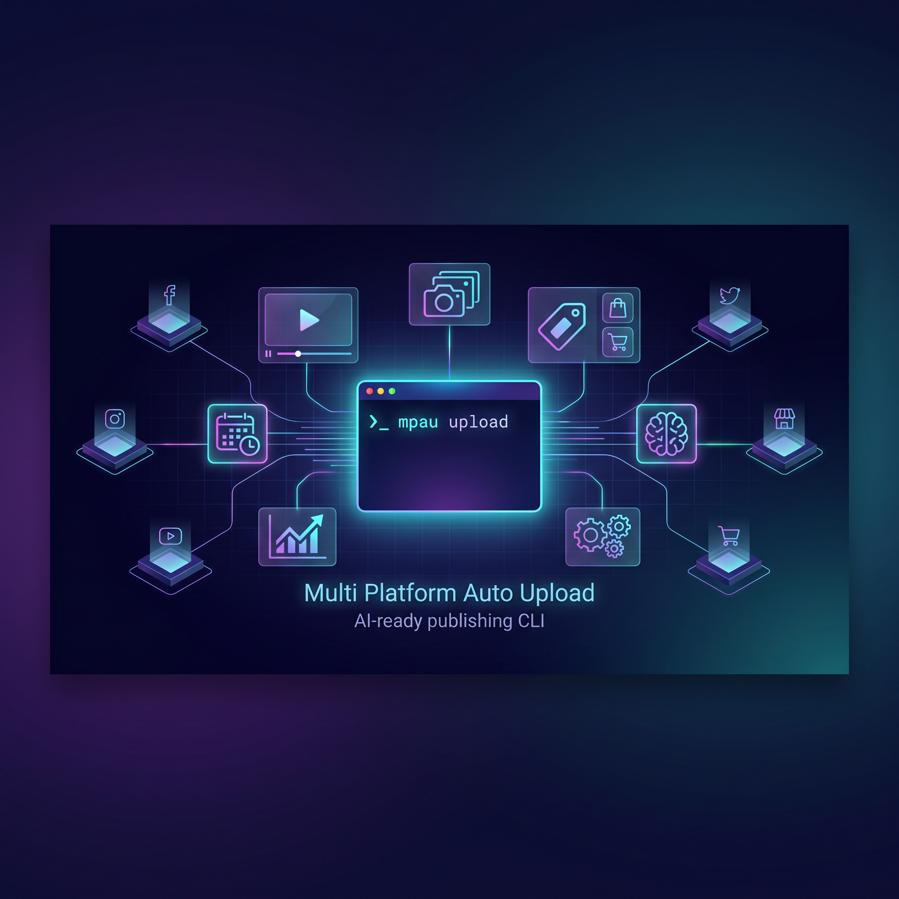
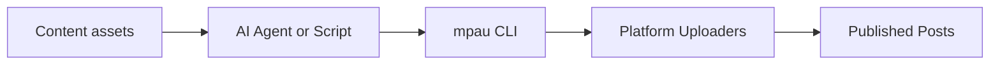

# Multi Platform Auto Upload

[English](README.md) | [简体中文](README.zh-CN.md)

<p align="center">
  
</p>

<p align="center">
  <a href="LICENSE"></a>
  
  
  
  
</p>

<p align="center">
  <b>One CLI to publish videos, notes, product content and scheduled posts across social media and e-commerce platforms.</b>
</p>

<p align="center">
  <b>Built for creators, sellers and AI agents.</b>
</p>

---

## What it does

| Publish automation | Commerce content | Agent workflow |
| --- | --- | --- |
| Videos, notes, covers, schedules | Product links, product IDs, shop accounts | Built-in Skills, CLI commands, log-based execution |

Stop copy-pasting the same content across platforms. Stop letting agents click blindly. Use `mpau` as the publishing backend for humans, scripts and AI agents.

---

## Supported platforms

<p align="center">
  
  
  
  
</p>

| Platform | Category | Video | Image/Text | Schedule | Product Link / ID | Agent Skill |
| --- | --- | --- | --- | --- | --- | --- |
| **Douyin** | 🟣 Social + Commerce | ✅ | ✅ | ✅ | ✅ Product link | ✅ |
| **WeChat Channels** | 🟢 Commerce | ✅ | — | ✅ | ✅ WeChat shop / showcase | ✅ |
| **PDD / Duoduo Video** | 🟢 Commerce | ✅ | — | ✅ | ✅ PDD product ID | ✅ |
| **Tmall / Taobao Guanghe** | 🟢 Commerce | ✅ | — | ✅ | ✅ Taobao / Tmall product ID | ✅ |
| **JD Jingmai** | 🟢 Commerce | ✅ | — | ✅ | ✅ JD product ID | ✅ |
| **Kuaishou** | 🟣 Social | ✅ | ✅ | ✅ | — | ✅ |
| **Xiaohongshu** | 🟣 Social | ✅ | ✅ | ✅ | — | ✅ |
| **Bilibili** | 🔵 Video | ✅ | — | ✅ | — | ✅ |
| **Baijiahao** | 🔵 Content | ✅ | — | ✅ | — | ✅ |
| **TikTok** | 🔵 Video | ✅ | — | ✅ | — | ✅ |

> If your workflow is **create once, publish everywhere**, `mpau` is the automation layer in between.

---

## Workflow



---

## Quick start

```bash
git clone https://github.com/cjccd/multi-platform-auto-upload.git
cd multi-platform-auto-upload

uv venv
source .venv/bin/activate
uv pip install -e .

python -m patchright install chromium
mpau --help
```

Login once:

```bash
mpau douyin login --account shop1 --headed
```

Check login state:

```bash
mpau douyin check --account shop1
```

Publish a video:

```bash
mpau douyin upload-video \
  --account shop1 \
  --file ./videos/demo.mp4 \
  --title "Product review" \
  --desc "A short product review video" \
  --tags "review,shopping,life" \
  --headed
```

Schedule a post:

```bash
mpau tmall upload-video \
  --account shop1 \
  --file ./videos/demo.mp4 \
  --title "New product review" \
  --schedule "2026-06-05 20:00" \
  --headed
```

Attach a product ID:

```bash
mpau jd upload-video \
  --account shop1 \
  --file ./videos/demo.mp4 \
  --title "Real product review" \
  --goods-id "10204078771126" \
  --headed
```

More setup details: [Installation](docs/installation.md)

---

## AI Agent ready

This repository ships with platform-specific skills under `skills/`.

Agents can:

1. read the corresponding `SKILL.md`
2. call `mpau check`
3. call `mpau upload-video` or `mpau upload-note`
4. inspect logs and report success, failure or required manual action

No more rediscovering publishing pages from screenshots every time.

More details: [Agent Integration](docs/agent-integration.md)

---

## Optional add-on: video analysis

`skills/video-analyze` helps agents understand videos before publishing:

- keyframe extraction
- speech-to-text transcription
- JSON output for downstream reasoning

Use it when you want an agent to generate better titles, tags, descriptions or platform choices from the video itself.

More details: [Video Analysis](docs/video-analysis.md)

---

## CLI shape

```bash
mpau <platform> <action> [options]
```

Common platforms:

```text
douyin | tencent | pdd | tmall | jd | kuaishou | xiaohongshu | bilibili | baijiahao | tiktok
```

Common actions:

```text
login | check | upload-video | upload-note | verify
```

---

## Project layout

```text
multi-platform-auto-upload/
├── mpau_cli.py      # CLI entry
├── uploader/        # Platform uploaders
├── skills/          # Agent Skills
├── utils/           # Shared utilities
├── docs/            # Detailed docs
└── tests/           # Lightweight tests
```

---

## Development

```bash
python3 -m unittest -v tests.test_mpau_cli
```

More details: [Development](docs/development.md)

---

## License

MIT License. See [LICENSE](LICENSE).

## Disclaimer

This project is intended for content creation, self-owned account operation and legitimate automation workflows. Please follow the rules of each platform and do not use automation to publish illegal, harmful or abusive content.
