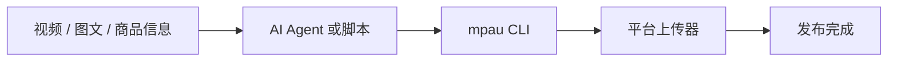

# Multi Platform Auto Upload

[English](README.md) | 简体中文

<p align="center">
  
</p>

<p align="center">
  <a href="LICENSE"></a>
  
  
  
  
</p>

<p align="center">
  <b>一个 CLI，把视频、图文、商品内容和定时发布分发到多个社媒和电商平台。</b>
</p>

<p align="center">
  <b>为自媒体创作者、电商商家和 AI Agent 设计。</b>
</p>

---

## 它能做什么

| 发布自动化 | 电商内容 | Agent 工作流 |
| --- | --- | --- |
| 视频、图文、封面、定时 | 商品链接、商品 ID、多店铺账号 | 内置 Skills、CLI 调用、日志判断 |

不要再把同一条内容复制粘贴到每个平台。不要再让 Agent 每次临场点网页。把 `mpau` 当成人、脚本和 AI Agent 都能调用的发布后端。

---

## 支持平台

**内容 / 创作者平台**

抖音 · 快手 · 小红书 · Bilibili · 百家号 · TikTok

**电商 / 商家内容平台**

视频号 · PDD 多多视频 · 天猫 / 淘宝光合 · 京东京麦

**内置 Agent Skills**

抖音 · 视频号 · PDD · 天猫 · 京东 · 快手 · 小红书 · Bilibili · 百家号 · TikTok · 视频分析

---

## 工作流



---

## 快速开始

```bash
git clone https://github.com/cjccd/multi-platform-auto-upload.git
cd multi-platform-auto-upload

uv venv
source .venv/bin/activate
uv pip install -e .

python -m patchright install chromium
mpau --help
```

登录一次：

```bash
mpau douyin login --account shop1 --headed
```

检查登录状态：

```bash
mpau douyin check --account shop1
```

发布视频：

```bash
mpau douyin upload-video \
  --account shop1 \
  --file ./videos/demo.mp4 \
  --title "视频标题" \
  --desc "视频描述" \
  --tags "测评,好物,生活" \
  --headed
```

定时发布：

```bash
mpau tmall upload-video \
  --account shop1 \
  --file ./videos/demo.mp4 \
  --title "新品测评" \
  --schedule "2026-06-05 20:00" \
  --headed
```

挂载商品 ID：

```bash
mpau jd upload-video \
  --account shop1 \
  --file ./videos/demo.mp4 \
  --title "新品真实测评" \
  --goods-id "10204078771126" \
  --headed
```

更多安装细节：[安装说明](docs/installation.md)

---

## 面向 AI Agent 设计

项目内置平台级 `skills/`。

Agent 可以：

1. 读取对应平台的 `SKILL.md`
2. 调用 `mpau check`
3. 调用 `mpau upload-video` 或 `mpau upload-note`
4. 根据日志判断成功、失败或是否需要人工操作

不需要每次重新看页面、猜按钮、临场操作浏览器。

更多说明：[Agent 集成](docs/agent-integration.md)

---

## 附属功能：视频分析

`skills/video-analyze` 可以在发布前帮助 Agent 理解视频内容：

- 抽取关键帧
- 语音转文字
- 输出 JSON，供后续推理使用

适合用来自动生成更好的标题、标签、描述，或判断更适合发布到哪个平台。

更多说明：[视频分析](docs/video-analysis.md)

---

## CLI 结构

```bash
mpau <platform> <action> [options]
```

常见平台：

```text
douyin | tencent | pdd | tmall | jd | kuaishou | xiaohongshu | bilibili | baijiahao | tiktok
```

常见动作：

```text
login | check | upload-video | upload-note | verify
```

---

## 项目结构

```text
multi-platform-auto-upload/
├── mpau_cli.py      # CLI 主入口
├── uploader/        # 平台上传器
├── skills/          # Agent Skills
├── utils/           # 公共工具
├── docs/            # 详细文档
└── tests/           # 轻量测试
```

---

## 开发与测试

```bash
python3 -m unittest -v tests.test_mpau_cli
```

更多说明：[开发说明](docs/development.md)

---

## License

MIT License. See [LICENSE](LICENSE).

## 免责声明

本项目仅用于辅助内容创作、商家自有账号运营和合法自动化测试。请遵守各平台规则，不要上传违规内容，不要滥用自动化能力。
